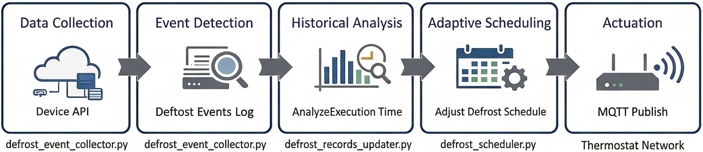

# Edge AI Adaptive Defrost Control System

An automated, edge-based optimization engine that reduces energy consumption in commercial refrigeration systems. This system analyzes real-time telemetry to dynamically adjust defrost cycles, significantly reducing energy consumption while maintaining strict food safety compliance.

---

## 🌟 Project Deep Dive

### Situation

In commercial refrigeration, food safety regulations require fixed defrost schedules to be displayed externally to explain temperature fluctuations during inspections. However, these rigid schedules often trigger unnecessary heating cycles even when frost accumulation is minimal, leading to substantial energy waste in commercial freezers.

### Task

The goal was to engineer an Edge AI optimization layer that dynamically adjusts defrost cycles based on real-time operational data. The challenge was to improve energy efficiency without altering the underlying regulatory scheduling framework or compromising storage temperatures.

### Action

I developed and deployed a three-tier automated pipeline on an edge gateway:

- Data Orchestration: Built a Defrost Event Collector that polls device telemetry via API, implementing state-machine logic to accurately identify and log defrost start/end events.

- Analytical Processing: Created a Records Updater to calculate execution efficiency by comparing recent cycle durations against historical baselines to infer frost levels.

- Intelligent Scheduling: Engineered a Defrost Scheduler that executes a comparison algorithm:
  - If a cycle is significantly shorter than the historical average (indicating low frost), the system triggers a "Skip" command for the next scheduled slot.

  - Optimization commands are dispatched to the thermostat network via MQTT.

- System Reliability: Orchestrated the entire pipeline using Cron-based task scheduling with precise time-offsets to ensure data integrity and prevent race conditions.

### Result

Validated through real-world deployment in commercial refrigeration units:

- Energy Efficiency: Achieved a 10.9% reduction in total energy consumption.

- Operational Impact: Saved approximately 267 kWh per month per system while maintaining 100% compliance with food safety requirements.

---

## 🚀 Key Engineering Highlights

- Edge-First Architecture: Deployed on edge gateways to ensure low-latency control and reduced cloud bandwidth costs.

- Adaptive Scheduling Logic: Implemented a historical analysis pipeline that calculates defrost execution efficiency to decide whether to skip upcoming cycles.

- Robust Data Pipeline: Engineered a multi-stage Python pipeline synchronized via non-blocking Cron orchestration to prevent race conditions.

- Industrial Protocol Integration: Seamlessly communicates with thermostat networks using MQTT and RESTful APIs.

---

## 🛠 Technologies

Domain: `Commercial Refrigeration` `Edge Computing` `Smart Energy`

Languages: `Python 3.8+ (Pandas, Paho-MQTT, Requests)`

Infrastructure: `Linux Edge Gateway` `Cron Jobs`

Communication: `MQTT` `RESTful API` `JSON/CSV`

---

## 🛠 System Architecture



The system operates as a five-stage automated pipeline:

1. Data Collection: Polls device telemetry via REST API every 5 minutes.

2. Event Detection: Identifies state transitions (On/Off) and logs granular defrost events.

3. Historical Analysis: Processes raw event logs into structured duration metrics.

4. Adaptive Scheduling: Runs optimization algorithms to generate new schedule parameters.

5. Actuation: Dispatches control commands to the thermostat network via MQTT.

---

## 📁 Project Structure

```bash
defrost-control
├── src/defrost_control/      # Core logic (Event Detection, Scheduling, MQTT)
├── scripts/                  # Automation & Cron deployment wrappers
├── config/                   # Dynamic device state & group configurations
├── data/                     # Local persistence for historical analysis
└── tests/                    # Unit testing for scheduling logic
```

---

## 🔧Technical Deep Dive

1. Intelligent Event Detection
   - Challenge: Raw API data is noisy.
   - Solution: Developed `defrost_event_collector.py` to implement a state-machine logic that filters transient spikes and accurately records the Start_time and End_time of actual defrost cycles.

2. Optimized Scheduling Algorithm
   - Logic: The `defrost_scheduler.py` evaluates the `DefrostTime` against historical thresholds. If a unit completes its cycle faster than expected, it indicates low frost buildup, and the system triggers a "Skip" command (Value: `144`) for the next slot.

3. Race Condition Prevention
   Implementation: Used time-offset Cron scheduling to ensure data integrity across the pipeline:

`*/5 * * * *` - Collector (High frequency)

`03 * * * *` - Updater (Hourly, offset to allow log finalization)

`05 * * * *` - Scheduler (Hourly, runs after data is refreshed)

---

## 💻Installation & Setup

```bash
# Clone the repository
git clone https://github.com/GuanWenChen/defrost-control.git

# Install dependencies
pip install -r requirements.txt

# Deploy the automated pipeline
chmod +x scripts/*.sh
./scripts/install_cron.sh
```

---

## 📊 Future Roadmap

- [ ] Transition from Cron to APScheduler for better Python-native orchestration.

- [ ] Implement a Grafana dashboard for real-time energy savings visualization.

- [ ] Integrate Machine Learning (LSTM) for predictive frost formation modeling.

---

## License

MIT License
